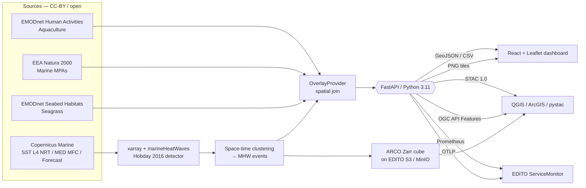

# MHEAT — Mediterranean Marine Heatwave Dashboard

**🌊 Live demo: <https://mediterian-heatwaves.com>** ·
[API docs](https://api.mediterian-heatwaves.com/api/docs) ·
[OGC API – Features](https://api.mediterian-heatwaves.com/api/ogcapi) ·
[STAC catalogue](https://api.mediterian-heatwaves.com/api/stac/collections)

[](LICENSE)
[](Dockerfile)
[](backend/tests)
[](backend/pyproject.toml)
[](backend/pyproject.toml)
[](.github/workflows/ci.yml)
[](backend/requirements.txt)
[](frontend/package.json)

**MHEAT** is a containerized web application and derived dataset for the
European Digital Twin Ocean ([EDITO](https://edito.eu)) platform. It detects
**Marine Heatwaves** (MHWs) in the Mediterranean and Adriatic on
[Copernicus Marine Service](https://marine.copernicus.eu) sea-surface
temperature products using the
[Hobday et al. (2016)](https://doi.org/10.1016/j.pocean.2015.12.014)
definition, visualises them alongside sectoral impact overlays
(aquaculture sites, Natura 2000 marine MPAs, *Posidonia* seagrass beds),
and publishes everything as GeoJSON / CSV / PNG tiles plus a STAC catalog.

Built for the **EDITO FSTP Call #1** (ref 26479-GRANT-EDITO2-APPLICATIONS,
deadline 6 May 2026).

---

## For EDITO reviewers — start here

**90-second tour:**

1. `cp .env.example .env` and fill in your Copernicus Marine username +
   password. Then `python scripts/bootstrap_climatology.py` (one-off, ~10-30
   min) builds the Hobday seasonal baseline into `data/cache/climatology.zarr`.
2. `docker compose up -d --build && open http://localhost:8000` — the
   container's startup hook prefetches the last 90 days of NRT SST into
   `data/cache/sst.zarr`; the request path lazy-fills any uncached date
   range from CMS the first time it's asked.
3. `python scripts/run_all.py` — **one command** to run every gate MHEAT's
   CI runs: env check → ruff → mypy → pytest → ESLint → vite build → vitest →
   pip-audit → npm audit → reproduce → ARCO → STAC. Prints a per-phase
   status grid and stops at the first failure. `--include-slow` adds the
   latency benchmark and a Docker build; `--only` / `--skip` narrow the run.
4. `python scripts/reproduce.py` — produces the reference GeoJSON / CSV /
   anomaly PNG / STAC manifest with pinned SHA-256 hashes listed in
   [`docs/reproducibility.md`](docs/reproducibility.md).
5. `cd backend && pytest` — 291 tests, 87.57 % line coverage (gate ≥ 85 %).
6. `cd frontend && npx vitest run` — 64 tests, 83.85 % line / 92.02 % branch coverage.

> **Map framing note:** the dashboard now opens with a Europe-wide view
> (Atlantic + Mediterranean + Baltic visible at zoom 4), but **MHW
> detection is still Mediterranean-only** for the Call #1 grant scope.
> Atlantic / Baltic basin expansion is booked as **Track A** in
> [`docs/future_work.md`](docs/future_work.md).

**How MHEAT maps to the 8 evaluation criteria:**

| # | Criterion | Weight | Where to look |
|---|---|---:|---|
| 1 | Excellence (science + innovation) | 15 | Hobday 2016 implementation in [`backend/app/mhw.py`](backend/app/mhw.py); calibration in [`docs/validation.md`](docs/validation.md); references in [`docs/reproducibility.md`](docs/reproducibility.md) |
| 2 | Impact (EU policy, societal value) | 15 | [`docs/policy_alignment.md`](docs/policy_alignment.md) — concrete mapping to MSFD D7, Mission Ocean, Aquaculture Guidelines, Biodiversity 2030, Ocean Pact, Climate Adaptation |
| 3 | Interoperability (standards) | 5 | OGC API — Features 1.0 at `/api/ogcapi`; STAC 1.0 at `/api/stac/collections`; ARCO Zarr export in [`scripts/export_arco.py`](scripts/export_arco.py); standards checklist in [`docs/edito_requirements.md`](docs/edito_requirements.md) |
| 4 | Implementation (workplan, risk, user guidance) | 15 | [`docs/risk_register.md`](docs/risk_register.md); Gantt in proposal §1.13; CI green across 5 jobs (`.github/workflows/ci.yml`) |
| 5 | Usability (contributes to EDITO dev) | 10 | JupyterLab tutorial in [`tutorials/`](tutorials/); Helm chart in [`charts/mheat`](charts/mheat); `ServiceMonitor` for EDITO Prometheus; reusable OGC process |
| 6 | Stakeholder engagement (co-design) | 10 | [`docs/stakeholders/co_design_log.md`](docs/stakeholders/co_design_log.md); letter-of-support drafts in [`docs/stakeholders/`](docs/stakeholders/) |
| 7 | Added value to EDITO (non-duplicative) | 10 | [`docs/edito_value.md`](docs/edito_value.md) — gap analysis vs current EDITO catalogue; [`scripts/prototypes/`](scripts/prototypes/) — 4 runnable extensibility prototypes with verdict in [`docs/prototypes_verdict.md`](docs/prototypes_verdict.md) |
| 8 | Price | 20 | €50 000 / 10 months; budget table in `DCE/.../MHEAT_MASTER.md` §1.12 |

**Architecture at a glance:**



**Technical-requirement compliance** (guidelines §4 + §5):

| Requirement | Met? | Evidence |
|---|:-:|---|
| Containerized (Docker image ≤ 1 GB) | ✅ | `Dockerfile`, final 333 MiB |
| Env-var configurable, no hard-coded creds | ✅ | `app/config.py`, `.env.example` |
| External-dependency inventory | ✅ | [`docs/edito_requirements.md`](docs/edito_requirements.md) + `requirements.txt` |
| Resource quota ≤ 32 GB RAM / 8 CPU / 50 GB tmp / 20 GB perm / no GPU | ✅ | Helm `resources:` block; `docs/edito_requirements.md` |
| ARCO output for datasets (Zarr) | ✅ | [`scripts/export_arco.py`](scripts/export_arco.py) |
| Open licence (MIT code, CC-BY 4.0 data) | ✅ | `LICENSE`; STAC Collection licence field |

---

## Run it all — one command

```bash
./run.sh              # Linux / macOS / Git-Bash
run.bat               # Windows cmd / PowerShell
```

Bootstraps a local `.venv/`, installs backend dev deps, runs every gate:
env check → ruff → mypy → pytest → ESLint → vite build → vitest → pip-audit
→ npm audit → reproduce → ARCO → STAC. Stops at the first failure.

Fast variants:

```bash
./run.sh --quick         # lint + type-check + tests + reproduce only  (~2 min)
./run.sh --include-slow  # + latency benchmark + Docker image build
./run.sh --list          # every phase the orchestrator knows about
./run.sh --only ruff     # any single phase by name
./run.sh --skip docker   # drop a phase
```

## Run it locally — 4 commands

```bash
git clone https://github.com/<your-org>/mheat.git
cd mheat
cp .env.example .env                                # fill in CMS creds
python scripts/bootstrap_climatology.py             # one-off, ~10-30 min
docker compose up -d --build
```

Then open <http://localhost:8000>. The service reads SST from a local Zarr
cache under `data/cache/sst.zarr` populated by the startup prefetch hook
(last 90 days of Copernicus Marine NRT) and lazy-fills any further-out date
range on demand. The Hobday seasonal climatology + 90th-percentile threshold
lives next to it in `data/cache/climatology.zarr` and is built once by
`scripts/bootstrap_climatology.py` so the request path never has to
recompute a 30-year reduction.

### Cache architecture

Three on-disk artefacts under `data/cache/` keep the runtime fast and
deterministic:

* `sst.zarr` — Mediterranean analysed SST, populated incrementally from CMS.
  Startup prefetch covers the last 90 days; further-out queries trigger a
  CMS subset and are merged into the cube on first hit.
* `climatology.zarr` — pre-computed Hobday seasonal mean + percentile
  threshold (`(366, lat, lon)` in °C). Built once via
  `scripts/bootstrap_climatology.py`; deterministic given inputs (see
  `Climatology.fingerprint()`).
* `cms/*.nc` — raw Copernicus Marine subsets kept around for traceability;
  the canonical view is the merged Zarr above.

**Reviewer path without your own CMS account:** clone the repo, drop the
release-asset bundle of `data/cache/` into place, and `docker compose up`.
The startup hook will skip the prefetch (no creds) but the cache already
covers the historical window so every endpoint serves from disk.

**What the climatology zarr is:** an xarray dataset with two variables —
`seas` (seasonal mean) and `thresh` (90th-percentile threshold) — shaped
**`(366, lat, lon)`** in **°C**, persisted as zarr v2 with Blosc/LZ4 +
consolidated metadata. **~500 MB** on disk for the Mediterranean at native
4.2 km grid. Deterministic given inputs: identical `(source_dataset,
clim_start, clim_end, bbox, window_half_width, smooth_width, pctile)` →
identical SHA-256 fingerprint (see `Climatology.fingerprint()` in
[`backend/app/climatology.py`](backend/app/climatology.py)).

**Readiness probe (`/api/readyz`):**

```bash
curl -s http://localhost:8000/api/readyz | jq
# {
#   "status": "ready",
#   "cms_credentials": true,
#   "cache_dir": "data/cache",
#   "zarr_store": "data/cache/sst.zarr",
#   "sst_cache_present": true,
#   "climatology_present": true,
#   "checks": [
#     {"name": "cache_dir_writable", "ok": true},
#     {"name": "cms_credentials", "ok": true},
#     {"name": "sst_cache", "ok": true,
#      "detail": "present at data/cache/sst.zarr"},
#     {"name": "climatology_artifact", "ok": true,
#      "detail": "present at data/cache/climatology.zarr"}
#   ]
# }
```

**Endpoint shapes:**

```bash
# /api/anomaly/extent — exposes the cached cube's actual time bounds
curl -s 'http://localhost:8000/api/anomaly/extent'
# {"start": "2026-01-25", "end": "2026-04-23", "n_days": 89,
#  "vmin_degC": -5.0, "vmax_degC": 5.0}

# /api/events without start/end → 400 dates_required
curl -s -i 'http://localhost:8000/api/events'
# HTTP/1.1 400 Bad Request
# {"error": {"status": "dates_required",
#            "detail": "start and end query params are required"}}

# /api/anomaly when the climatology zarr is missing → 503 climatology_missing
curl -s -i 'http://localhost:8000/api/anomaly?date=2026-04-20'
# HTTP/1.1 503 Service Unavailable
# {"status": "climatology_missing",
#  "detail": "Run scripts/bootstrap_climatology.py first.",
#  "climatology_store": "data/cache/climatology.zarr"}
```

### Local development

```bash
# backend
cd backend && python -m venv .venv && source .venv/bin/activate
pip install -r requirements.txt
uvicorn app.main:app --reload

# frontend (separate terminal)
cd frontend && npm install && npm run dev
```

Open <http://localhost:5173> — Vite proxies `/api` to `:8000`.

### Tests

```bash
cd backend && pytest -q
# coverage gate enforced at ≥85 %
```

---

## Architecture

```
+------------------------- docker image (333 MiB) -------------------------+
|                                                                          |
|  /srv/frontend     Vite build   (React 18 + Leaflet + lazy Plotly)       |
|  /srv/app          FastAPI       (Python 3.11 + xarray + marineHeatWaves)|
|                                                                          |
|   Client                                                                 |
|     │ HTTP                                                               |
|     ▼                                                                    |
|   FastAPI ── /api/health, /api/events, /api/events.csv,                  |
|               /api/events/{id}/series, /api/anomaly,                     |
|               /api/overlays/*, /api/stac/*, /api/processes/*             |
|                                                                          |
|   Data flow:                                                             |
|     Copernicus Marine NRT/Reanalysis/Forecast                            |
|       │ (lazy-fill on cache miss)                                        |
|       ▼                                                                  |
|     data/cache/sst.zarr ────▶ xarray cube                                |
|                                │                                         |
|                                ▼                                         |
|     Climatology zarr ──────▶ marineHeatWaves (Hobday 2016, per-pixel)    |
|     (366×lat×lon, °C,          │                                         |
|      built one-off via         ▼                                         |
|      bootstrap_climatology.py) cluster_events → GeoJSON+CSV+PNG+STAC     |
|                                                                          |
|     EMODnet / EEA WFS ──▶ OverlayProvider ──▶ GeoJSON                   |
|     impact.compute_impact joins events × overlays                        |
|                                                                          |
+--------------------------------------------------------------------------+
```

* **Backend** — Python 3.11, FastAPI, Uvicorn, xarray, marineHeatWaves, shapely, matplotlib.
* **Frontend** — React 18, Vite, TypeScript, Leaflet, Plotly (code-split into a lazy chunk).
* **Detection** — 11-day centred window, 90th-percentile threshold, ≥5-day duration, 2-day gap-join — the canonical Hobday 2016 recipe.
* **Output** — Zarr SST cube + derived diagnostics, GeoJSON events, streamable CSV, PNG anomaly tiles, STAC catalog.
* **12-factor** — every path, endpoint and credential is configured via env vars (`.env.example`).

---

## API

Swagger UI at <http://localhost:8000/api/docs>, ReDoc at `/api/redoc`,
raw spec at `/api/openapi.json`.

| Method | Path | Description |
|---|---|---|
| `GET` | `/api/health` | Liveness probe (service version) |
| `GET` | `/api/readyz` | Readiness — cache writability, CMS credentials, SST cube + climatology presence |
| `GET` | `/api/events` | Detected MHWs as GeoJSON (clustered by default) |
| `GET` | `/api/events.csv` | Same catalog as CSV (streaming, Excel-friendly) |
| `GET` | `/api/events.parquet` | Same catalog as **GeoParquet v1.0** (CRS84, snappy), direct-consumable by QGIS / DuckDB / GeoPandas |
| `GET` | `/api/events/{id}/series?lon=&lat=` | SST + climatology + 90p threshold time-series (drill-down chart) |
| `POST` | `/api/processes/mhw-detect` | OGC-API-Processes-style run with impact join |
| `GET` | `/api/overlays/{aquaculture\|mpa\|seagrass}` | Sectoral overlays |
| `GET` | `/api/anomaly?date=` | PNG tile of SST anomaly (cached + ETag) |
| `GET` | `/api/anomaly/extent` | Temporal extent of the anomaly endpoint |
| `GET` | `/api/data` | Browse ARCO Zarr assets (JSON index, with sizes + MIME) |
| `GET` | `/api/data/sst.zarr` | Consolidated Zarr metadata for the cached SST cube |
| `GET` | `/api/data/sst.zarr/{chunk}` | Any inner Zarr file or chunk (`xarray.open_zarr` follows this) |
| `GET` | `/api/data/climatology.zarr` | Consolidated Zarr metadata for the Hobday baseline |
| `GET` | `/api/stac/collections` | STAC catalog root |
| `GET` | `/api/stac/collections/{id}/items` | STAC items (dynamic) |
| `GET` | `/api/ogcapi` | OGC API - Features 1.0 landing page |
| `GET` | `/api/ogcapi/conformance` | OGC API conformance classes |
| `GET` | `/api/ogcapi/collections` | Collections: mhw-events, aquaculture, mpa, seagrass |
| `GET` | `/api/ogcapi/collections/{id}/items` | Paged GeoJSON (`bbox`, `datetime`, `limit`, `offset`) |
| `GET` | `/api/ogcapi/collections/{id}/items/{fid}` | Single feature |
| `GET` | `/api/metrics` | Prometheus exposition text (404 when `METRICS_ENABLED` is off) |

Query `/api/events` with `?bbox=lon_min,lat_min,lon_max,lat_max&start=&end=&min_category=&raw=`
for spatial/temporal/severity filters.

### Desktop GIS hookup

Point **QGIS** at `http://localhost:8000/api/ogcapi` → *Add OGC API-Features Layer*
to consume MHEAT polygons natively, with full bbox/datetime filtering.

---

## EDITO deployment (Kubernetes + Helm)

A Helm chart lives in [`charts/mheat`](charts/mheat):

```bash
kubectl create secret generic mheat-cms \
  --from-literal=username="$CMS_USER" --from-literal=password="$CMS_PASS"

helm upgrade --install mheat ./charts/mheat \
  --set ingress.hosts[0].host=mheat.edito.example
```

Enable `/api/metrics` and a Prometheus Operator `ServiceMonitor`:

```bash
helm upgrade --install mheat ./charts/mheat \
  --set env.METRICS_ENABLED=true \
  --set serviceMonitor.enabled=true
```

The chart mounts a `ReadWriteOnce` PVC at `/data/cache` for the Zarr cube,
pulls CMS credentials from the `mheat-cms` Secret, exposes an Ingress, and
wires `/api/health` / `/api/readyz` as k8s probes. A daily CronJob can invoke
`scripts/update_daily.py` to append yesterday's SST slice and refresh the
event cache.

---

## Operations

### Environment variables (v0.3.0 additions)

| Var | Default | Purpose |
|---|---|---|
| `LOG_FORMAT` | `json` | `json` emits one JSON object per log line; `text` is human-readable. |
| `LOG_LEVEL` | `info` | Standard Python log level. |
| `OTEL_EXPORTER_OTLP_ENDPOINT` | *(unset)* | Enables OpenTelemetry tracing (OTLP/gRPC). No-op when unset. |
| `OTEL_SERVICE_NAME` | `mheat` | OTEL resource service.name. |
| `METRICS_ENABLED` | `false` | When true, exposes `/api/metrics` (Prometheus text) and records HTTP + pipeline histograms. |

### Structured logging

Every request emits:

```json
{"timestamp":"2026-04-17T14:02:33.482Z","level":"INFO","logger":"mheat.access",
 "message":"http_request","request_id":"a8f2…","path":"/api/events",
 "method":"GET","status_code":200,"duration_ms":43.2}
```

Propagate `X-Request-Id` from your edge proxy — MHEAT will honor it instead
of generating a new one.

### Performance benchmark

```bash
python scripts/bench.py --base-url http://localhost:8000 --iterations 20
# writes docs/performance.md with P50/P95/P99 per endpoint
```

Target: **P95 ≤ 2000 ms** on a laptop. Current measurements in
[`docs/performance.md`](docs/performance.md).

### Reproducibility

```bash
python scripts/reproduce.py
# writes events.geojson, events.csv, anomaly PNG, STAC / OGC API landing
# JSON and a SHA-256 manifest into out/
```

See [`docs/reproducibility.md`](docs/reproducibility.md) for the pinned
reference manifest, the Hobday 2016 parameter choices and the cached
Zarr provenance. CI runs the same script against the cached cube and
uploads the manifest as an artefact.

### CI jobs

| Job | What it checks |
|---|---|
| `backend`  | `ruff check` (10 rule groups) + `mypy` + `pytest` (291 tests, line coverage 87.57 %, gate ≥ 85 %) |
| `frontend` | `npm ci` + `vite build` (main bundle 16.13 KB gzipped) |
| `unit`     | Vitest + `@testing-library/react` (64 tests, jsdom, line coverage 83.85 %, branch 92.02 %, gate ≥ 80 %) |
| `a11y`     | Playwright + `@axe-core/playwright` → zero WCAG 2.1 AA violations |
| `security` | `pip-audit --strict` + `npm audit --audit-level=high` (HIGH/CRITICAL block) |
| `docker`   | Builds the image; Trivy scan (HIGH/CRITICAL block); fails if > 500 MiB; pushes to GHCR on main |

---

## Tutorials

Runnable Jupyter notebooks live under [`tutorials/`](tutorials/). Every code
cell is universal; only the narrative is translated:

| Language | Notebook |
|---|---|
| English | [`mhw_mediterranean.ipynb`](tutorials/mhw_mediterranean.ipynb) |
| Français | [`mhw_mediterranean_fr.ipynb`](tutorials/mhw_mediterranean_fr.ipynb) |
| Italiano | [`mhw_mediterranean_it.ipynb`](tutorials/mhw_mediterranean_it.ipynb) |

They cover loading an SST cube (synthetic or live CMS), running the Hobday
detector, clustering, and joining with sectoral overlays. Copy–paste into
the EDITO Datalab JupyterLab service and run.

---

## Contributing

1. Fork & clone.
2. `docker compose up -d --build` — make sure it boots and `/api/health` returns 200.
3. `cd backend && pytest` — all 291 tests must pass and line coverage must stay ≥ 85 %.
4. For frontend work: `cd frontend && npm install && npm run build && npm run test:unit` must succeed.
5. Open a PR against `main`. Please include a one-line changelog entry in the PR body.

Reporting bugs: please attach a minimal reproducing request + the contents of
`/api/health`.

---

## Data sources & licenses

| Source | Product | License |
|---|---|---|
| Copernicus Marine Service | `SST_MED_SST_L4_NRT_OBSERVATIONS_010_004` (NRT), `MEDSEA_MULTIYEAR_PHY_006_004` (reanalysis), `MEDSEA_ANALYSISFORECAST_PHY_006_013` (forecast) | [Copernicus License](https://marine.copernicus.eu/user-corner/service-commitments-and-licence) |
| EMODnet Human Activities | Aquaculture sites (WFS) | CC-BY 4.0 |
| EMODnet Seabed Habitats | EUSeaMap / seagrass (WFS) | CC-BY 4.0 |
| EEA | Natura 2000 marine sites (WFS) | EEA standard re-use |

---

## Citations

* **Hobday, A. J., Alexander, L. V., Perkins, S. E., Smale, D. A., *et al.* (2016).**
  *A hierarchical approach to defining marine heatwaves.* **Progress in Oceanography**, 141, 227–238.
  <https://doi.org/10.1016/j.pocean.2015.12.014>
* **Hobday, A. J., Oliver, E. C. J., *et al.* (2018).** *Categorizing and naming
  marine heatwaves.* **Oceanography**, 31(2), 162–173.
* **Oliver, E. C. J. (2019).** `marineHeatWaves` — Python package for identification of
  marine heat waves. <https://github.com/ecjoliver/marineHeatWaves>
* **E.U. Copernicus Marine Service Information.**
* **EMODnet Human Activities / Seabed Habitats** — <https://emodnet.ec.europa.eu>.
* **EEA Natura 2000** — <https://www.eea.europa.eu/data-and-maps/data/natura-13>.

---

## License

MIT — see [`LICENSE`](LICENSE).

---

## Project layout

```
mheat/
├── backend/                  FastAPI + Python 3.11
│   ├── app/
│   │   ├── main.py           app factory, lifespan, SPA fallback
│   │   ├── config.py         pydantic_settings
│   │   ├── sst.py            Copernicus SDK + synthetic fixture
│   │   ├── mhw.py            Hobday 2016 wrapper over marineHeatWaves
│   │   ├── overlays.py       EMODnet + EEA fetchers (WFS)
│   │   ├── impact.py         events × overlays spatial join
│   │   ├── cache.py          filesystem + Zarr store
│   │   ├── stac.py           dynamic STAC catalog
│   │   └── routers/          health, events, detect, overlays, stac, anomaly
│   └── tests/                291 unit / integration tests (coverage 87.57 %)
├── frontend/                 Vite + React 18 + TS + Leaflet + lazy Plotly
├── charts/mheat/             Helm chart for EDITO k8s
├── scripts/
│   ├── update_daily.py       daily CronJob entrypoint
│   └── backfill.py           one-off 1982→present
├── tutorials/                EN / FR / IT notebooks
├── Dockerfile                multi-stage, 333 MiB
├── docker-compose.yml
└── .env.example
```
